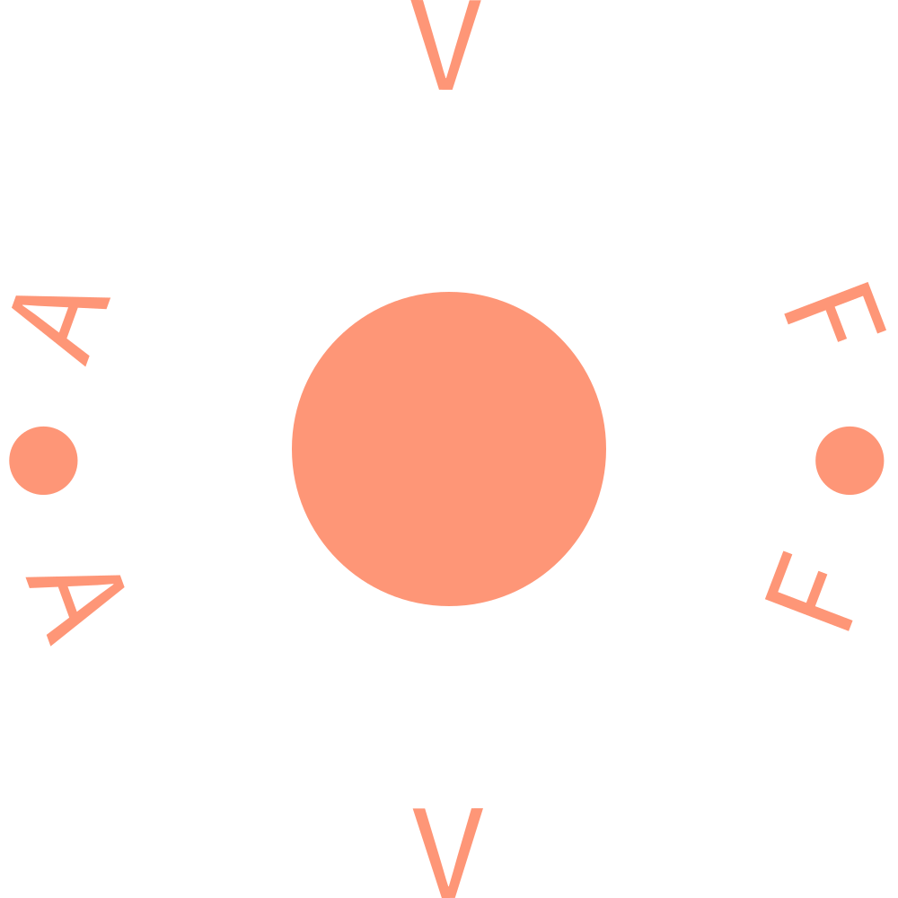

<a href="https://www.linkedin.com/in/andrei-findrihan/">![LinkedIn][linkedin-shield]</a>

<!-- PROJECT LOGO -->
 

  

<h3 align="center">Andrei Findrihan Portfolio</h3>

  

    Experience showcase
     
    <a href="https://andreifindrihan.com"><strong>View website »</strong></a>
  

 

[![Product Name Screen Shot][product-screenshot]](https://andreifindrihan.com)

### Built With

- 
- 
- 
- 
- 

<!-- MARKDOWN LINKS & IMAGES -->

[linkedin-shield]: https://img.shields.io/badge/-LinkedIn-black.svg?style=for-the-badge&logo=linkedin&colorB=555
[product-screenshot]: src/assets//showcase.png
